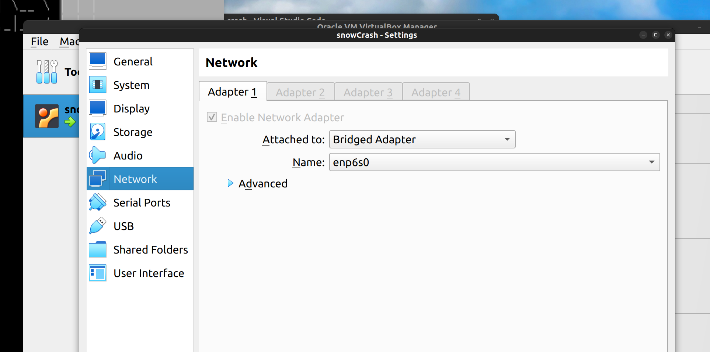
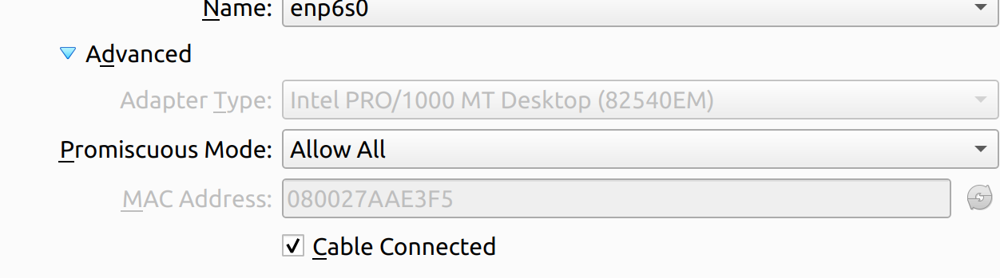
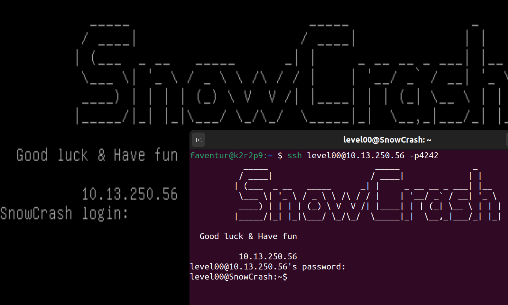
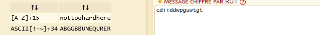

# Preparation

To set up a bridged adapter:




To connect via SSH to the virtual machine:
```
~ $ ssh level00@10.13.250.56 -p4242
```



# Flag00

After some exploration, I discovered:
```
level00@SnowCrash:~$ cd /usr/sbin
level00@SnowCrash:/usr/sbin$ ls -la
total 5784
<SNIP>
----r--r--  1 flag00  flag00      15 Mar  5  2016 john
<SNIP>
level00@SnowCrash:/usr/sbin$ cat john
cdiiddwpgswtgt
```
Then thanks to [Dcode](https://www.dcode.fr/chiffre-rot) I coud be able to identify its encryption in ROT15 and decrypt it:

My flag is:
```
nottoohardhere
```
And I enter the flag00 user:
```
level00@SnowCrash:/usr/sbin$ su flag00
Password:
Don't forget to launch getflag !
flag00@SnowCrash:~$ getflag
Check flag.Here is your token : x24ti5gi3x0ol2eh4esiuxias
flag00@SnowCrash:~$
```
Now I enter the newly obtained flag as password for user `level01`:
```
flag00@SnowCrash:~$ su level01
Password:
level01@SnowCrash:~$