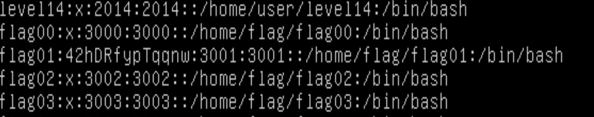

# Flag01

By displaying the file `/etc/passwd`:
```
level01@SnowCrash:~$ cat /etc/passwd
```
I revealed what seems to be flag01's password:
```
flag01:42hDRfypTqqnw:3001:3001::/home/flag/flag01:/bin/bash
```

I cracked it with [John the Ripper](https://www.openwall.com/john). From my WSL2 shell session:
```
$ cat flag01
42hDRfypTqqnw

$ john flag01
Using default input encoding: UTF-8
Loaded 1 password hash (descrypt, traditional crypt(3) [DES 256/256 AVX2])
Will run 8 OpenMP threads
Proceeding with single, rules:Single
Press 'q' or Ctrl-C to abort, almost any other key for status
Almost done: Processing the remaining buffered candidate passwords, if any.
Proceeding with wordlist:/usr/share/john/password.lst
abcdefg          (?)
1g 0:00:00:00 DONE 2/3 (2024-03-08 00:10) 20.00g/s 983040p/s 983040c/s 983040C/s 123456..lucky0
Use the "--show" option to display all of the cracked passwords reliably
Session completed.
```
My password is `abcdefg`:
```
level01@SnowCrash:/$ su flag01
Password:
Don't forget to launch getflag !
flag01@SnowCrash:~$ getflag
Check flag.Here is your token : f2av5il02puano7naaf6adaaf
flag01@SnowCrash:~$ su level02
Password:
level02@SnowCrash:~$