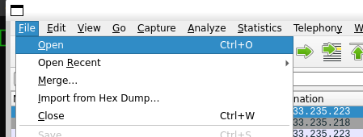
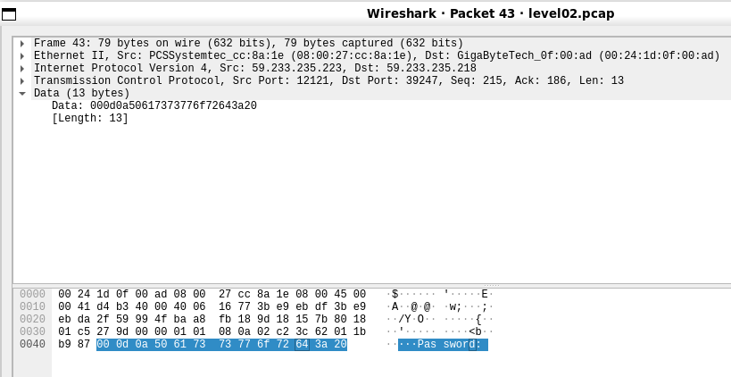
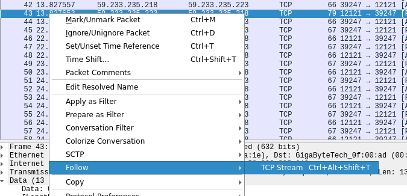
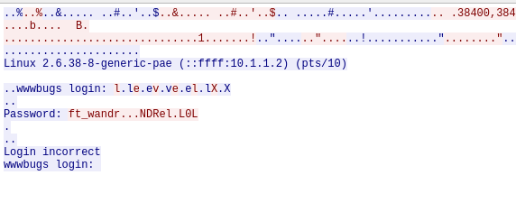

# Flag02

There's a `.pcap` file in my home directory:
```
level02@SnowCrash:~$ ls -la
total 24
dr-x------ 1 level02 level02  120 Mar  5  2016 .
d--x--x--x 1 root    users    340 Aug 30  2015 ..
-r-x------ 1 level02 level02  220 Apr  3  2012 .bash_logout
-r-x------ 1 level02 level02 3518 Aug 30  2015 .bashrc
----r--r-- 1 flag02  level02 8302 Aug 30  2015 level02.pcap
-r-x------ 1 level02 level02  675 Apr  3  2012 .profile
```
To transfer a file to my session I use [scp](https://linuxize.com/post/how-to-use-scp-command-to-securely-transfer-files). In a local shell session I type:
```
$ scp -P 4242 level02@10.13.250.56:/home/user/level02/level02.pcap ~/
```

A `.pcap` is a [Packet Capture](https://www.solarwinds.com/resources/it-glossary/pcap) file extension. Packet capture is a networking practice involving the interception of data packets travelling over a network that are stored by IT teams for further analysis. The inspection of these packets allows IT teams to identify issues and [solve network problems](https://www.solarwinds.com/network-performance-monitor/use-cases/network-troubleshooting) affecting daily operations.

It may be opened with Wireshark:
```
$ wireshark
```

Packet 43 contains the following string:
```
Data: 000d0a50617373776f72643a20
[Length: 13]
```
defined as "Pas sword" in hexadecimals:

We may see that there are different attempted logins on the part of 59.233.235.218.

Right click on packet 43:



If we look at the packets data, starting from packet 43, we may see the following characters, forming a username and a password:
```
levelX\rft_wandr<DEL><DEL><DEL>NDRel<DEL>L0L\r
```
If we [erase](https://en.wikipedia.org/wiki/Delete_character) the wrong characters from the password, we will obtain the password:
```
ft_waNDReL0L
```
If we try to log as flag02 with that password we succeed:
```
level02@SnowCrash:/var/spool/cron$ su flag02
Password:
Don't forget to launch getflag !
flag02@SnowCrash:~$ getflag
Check flag.Here is your token : kooda2puivaav1idi4f57q8iq
flag02@SnowCrash:~$ su level03
Password:
level03@SnowCrash:~$