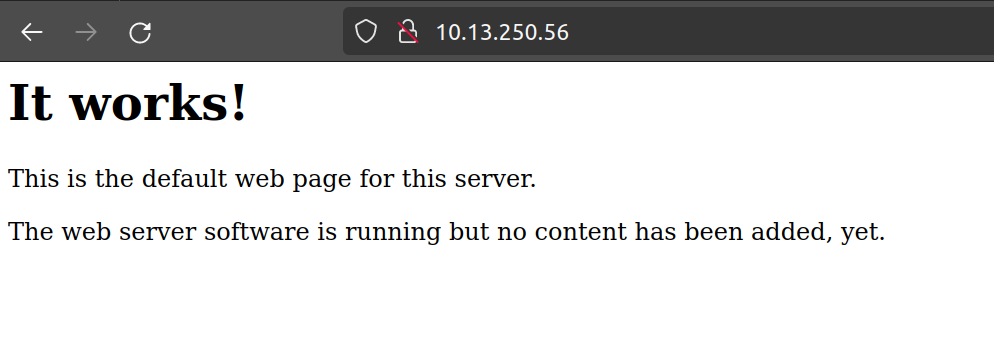
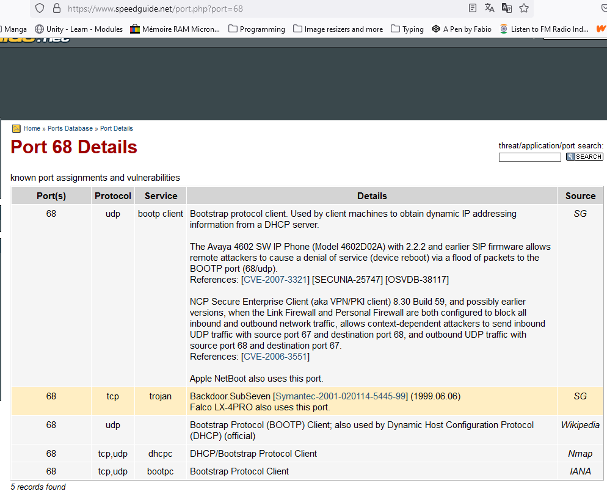

# Flag14

My home directory is empty.
I try the following commands to [find](https://www.cyberciti.biz/faq/how-do-i-find-all-the-files-owned-by-a-particular-user-or-group) something interesting for me:
```
find / -perm -100 -type f 2>/dev/null # 4 for r, 2 for w, 1 for x
find / -group level14 2>/dev/null
```
but to no avail.
So I try to find and test open connections:
```
level14@SnowCrash:~$ netstat -tunlp
(No info could be read for "-p": geteuid()=2014 but you should be root.)
Active Internet connections (only servers)
Proto Recv-Q Send-Q Local Address           Foreign Address         State       PID/Program name
tcp        0      0 0.0.0.0:4242            0.0.0.0:*               LISTEN      -
tcp        0      0 127.0.0.1:5151          0.0.0.0:*               LISTEN      -
tcp6       0      0 :::4646                 :::*                    LISTEN      -
tcp6       0      0 :::4747                 :::*                    LISTEN      -
tcp6       0      0 :::80                   :::*                    LISTEN      -
tcp6       0      0 :::4242                 :::*                    LISTEN      -
udp        0      0 0.0.0.0:68              0.0.0.0:*                           -
level14@SnowCrash:~$
```


[BootP and DHCP](https://orhanergun.net/bootp-vs-dhcp) are two of the most commonly used protocols for network configuration. BootP stands for **Bootstrap Protocol**, while DHCP stands for Dynamic Host Configuration Protocol. Both protocols are used to assign IP addresses to network devices, but they differ in terms of how they do it.

There's nothing, so what can we do but reverse-engineer the `getflag` binary?

Let's open it with Ghidra:
```
char * afterSubstr(char *src,int offset)
{
  int i;
  char *str;
  bool falsehood;
  
  falsehood = false;
  for (str = src; *str != '\0'; str = str + 1) {
    falsehood = true;
    for (i = 0; (falsehood && (*(char *)(i + offset) != '\0')); i = i + 1) {
      if (*(char *)(i + offset) != str[i]) {
        falsehood = false;
      }
    }
    if (falsehood) break;
  }
  if (falsehood) {
    str = str + i;
  }
  else {
    str = (char *)0x0;
  }
  return str;
}


size_t isLib(char *src,int offset)
{
  char *substr;
  size_t ret;
  int i;
  char *ptr;
  bool falsehood;
  
  substr = afterSubstr(src,offset);
  if (substr == (char *)0x0) {
    ret = 0;
  }
  else if (*substr == '-') {
    falsehood = false;
    while ((ptr = substr + 1, '/' < *ptr && (*ptr < ':'))) {
      falsehood = true;
      substr = ptr;
    }
    if ((falsehood) && (*ptr == '.')) {
      falsehood = false;
      for (ptr = substr + 2; ('/' < *ptr && (*ptr < ':')); ptr = ptr + 1) {
        falsehood = true;
      }
      if (falsehood) {
        for (i = 0; end.3187[i] != '\0'; i = i + 1) {
          if (end.3187[i] != ptr[i]) {
            return 0;
          }
        }
        ret = 1;
      }
      else {
        ret = 0;
      }
    }
    else {
      ret = 0;
    }
  }
  else {
    ret = 0;
  }
  return ret;
}
```

```
char * ft_des(char *str)
{
  char *strdup_ptr;
  uint max_ui;
  char *dup_ptr;
  byte bbzero;
  uint local_20;
  int local_1c;
  int local_18;
  int local_14;
  char c;
  
  bbzero = 0;
  strdup_ptr = strdup(str);
  local_1c = 0;
  local_20 = 0;
  do {
    max_ui = 0xffffffff;
    dup_ptr = strdup_ptr;
    do {
      if (max_ui == 0) break;
      max_ui = max_ui - 1;
      c = *dup_ptr;
      dup_ptr = dup_ptr + (uint)bbzero * -2 + 1;
    } while (c != '\0');
    if (~max_ui - 1 <= local_20) {
      return strdup_ptr;
    }
    if (local_1c == 6) {
      local_1c = 0;
    }
    if ((local_20 & 1) == 0) {
      if ((local_20 & 1) == 0) {
        for (local_14 = 0; local_14 < "0123456"[local_1c]; local_14 = local_14 + 1) {
          strdup_ptr[local_20] = strdup_ptr[local_20] + -1;
          if (strdup_ptr[local_20] == '\x1f') {
            strdup_ptr[local_20] = '~';
          }
        }
      }
    }
    else {
      for (local_18 = 0; local_18 < "0123456"[local_1c]; local_18 = local_18 + 1) {
        strdup_ptr[local_20] = strdup_ptr[local_20] + '\x01';
        if (strdup_ptr[local_20] == '\x7f') {
          strdup_ptr[local_20] = ' ';
        }
      }
    }
    local_20 = local_20 + 1;
    local_1c = local_1c + 1;
  } while( true );
}
```

```
int main(void)
{
  long ptrace_ret;
  char *ld_prel_check;
  int ld.so.prel_fd;
  int proc.self.maps_fd;
  __uid_t _uid;
  uint getline;
  int in_GS_OFFSET;
  char char_buf [256];
  int stack_cookie;
  bool falsehood;
  FILE *outfile;
  
  stack_cookie = *(int *)(in_GS_OFFSET + 0x14);
  falsehood = false;
  ld.so.prel_fd = 1;
  outfile = (FILE *)0x0;
  ptrace_ret = ptrace(PTRACE_TRACEME,0,1,0);
  if (ptrace_ret < 0) {
    ld_prel_check = "You should not reverse this";
    puts("You should not reverse this");
    proc.self.maps_fd = 1;
  }
  else {
    ld_prel_check = getenv("LD_PRELOAD");
    if (ld_prel_check == (char *)0x0) {
      ld.so.prel_fd = open("/etc/ld.so.preload",0);
      if (ld.so.prel_fd < 1) {
        proc.self.maps_fd = syscall_open("/proc/self/maps",0);
        if (proc.self.maps_fd == -1) {
          ld.so.prel_fd = 0x46;
          outfile = (FILE *)0x1;
          ld_prel_check = "/proc/self/maps is unaccessible, probably a LD_PRELOAD attempt exit..\n";
          fwrite("/proc/self/maps is unaccessible, probably a LD_PRELOAD attempt exit..\n",1,0x46,
                 stderr);
          proc.self.maps_fd = 1;
        }
        else {
          do {
            do {
              while( true ) {
                outfile = (FILE *)0x100;
                ld_prel_check = char_buf;
                ld.so.prel_fd = proc.self.maps_fd;
                getline = syscall_gets((int)ld_prel_check,0x100);
                if (getline == 0) goto LAB_08048ead;
                ld.so.prel_fd = isLib(char_buf,0x8049063);
                if (ld.so.prel_fd == 0) break;
                falsehood = true;
              }
            } while (!falsehood);
            ld.so.prel_fd = isLib(char_buf,0x8049068);
            if (ld.so.prel_fd != 0) {
              ld.so.prel_fd = 0x20;
              fwrite("Check flag.Here is your token : ",1,0x20,stdout);
              _uid = getuid();
              outfile = stdout;
              if (_uid == 0xbbe) { // 3006
                ld_prel_check = ft_des("H8B8h_20B4J43><8>\\ED<;j@3");
                fputs(ld_prel_check,outfile);
              }
              else if (_uid < 0xbbf) { // 3007
                if (_uid == 0xbba) { // 3002
                  ld_prel_check = ft_des("<>B16\\AD<C6,G_<1>^7ci>l4B");
                  fputs(ld_prel_check,outfile);
                }
                else if (_uid < 0xbbb) { // 3003
                  if (_uid == 3000) {
                    ld_prel_check = ft_des("I`fA>_88eEd:=`85h0D8HE>,D");
                    fputs(ld_prel_check,outfile);
                  }
                  else if (_uid < 0xbb9) { // 3001
                    if (_uid == 0) {
                      ld.so.prel_fd = 0x21;
                      fwrite("You are root are you that dumb ?\n",1,0x21,stdout);
                    }
                    else {
LAB_08048e06:
                      ld.so.prel_fd = 0x38;
                      fwrite("\nNope there is no token here for you sorry. Try again :)",1,0x38,
                             stdout);
                    }
                  }
                  else {
                    ld_prel_check = ft_des("7`4Ci4=^d=J,?>i;6,7d416,7");
                    fputs(ld_prel_check,outfile);
                  }
                }
                else if (_uid == 0xbbc) { // 3004
                  ld_prel_check = ft_des("?4d@:,C>8C60G>8:h:Gb4?l,A");
                  fputs(ld_prel_check,outfile);
                }
                else if (_uid < 0xbbd) { // 3005
                  ld_prel_check = ft_des("B8b:6,3fj7:,;bh>D@>8i:6@D");
                  fputs(ld_prel_check,outfile);
                }
                else {
                  ld_prel_check = ft_des("G8H.6,=4k5J0<cd/D@>>B:>:4");
                  fputs(ld_prel_check,outfile);
                }
              }
              else if (_uid == 0xbc2) { // 3010
                ld_prel_check = ft_des("74H9D^3ed7k05445J0E4e;Da4");
                fputs(ld_prel_check,outfile);
              }
              else if (_uid < 0xbc3) { // 3011
                if (_uid == 0xbc0) { // 3008
                  ld_prel_check = ft_des("bci`mC{)jxkn<\"uD~6%g7FK`7");
                  fputs(ld_prel_check,outfile);
                }
                else if (_uid < 0xbc1) { // 3009
                  ld_prel_check = ft_des("78H:J4<4<9i_I4k0J^5>B1j`9");
                  fputs(ld_prel_check,outfile);
                }
                else {
                  ld_prel_check = ft_des("Dc6m~;}f8Cj#xFkel;#&ycfbK");
                  fputs(ld_prel_check,outfile);
                }
              }
              else if (_uid == 0xbc4) { // 3012
                ld_prel_check = ft_des("8_Dw\"4#?+3i]q&;p6 gtw88EC");
                fputs(ld_prel_check,outfile);
              }
              else if (_uid < 0xbc4) { // 3012
                ld_prel_check = ft_des("70hCi,E44Df[A4B/J@3f<=:`D");
                fputs(ld_prel_check,outfile);
              }
              else if (_uid == 0xbc5) { // 3013
                ld_prel_check = ft_des("boe]!ai0FB@.:|L6l@A?>qJ}I");
                fputs(ld_prel_check,outfile);
              }
              else {
                if (_uid != 0xbc6) goto LAB_08048e06; // 3014
                ld_prel_check = ft_des("g <t61:|4_|!@IF.-62FH&G~DCK/Ekrvvdwz?v|");
                fputs(ld_prel_check,outfile);
              }
              ld_prel_check = (char *)0xa;
              outfile = stdout;
              fputc(10,stdout);
              goto LAB_08048ead;
            }
            ld_prel_check = afterSubstr(char_buf,0x8049281);
          } while (ld_prel_check != (char *)0x0);
          ld.so.prel_fd = 0x30;
          outfile = (FILE *)0x1;
          ld_prel_check = "LD_PRELOAD detected through memory maps exit ..\n";
          fwrite("LD_PRELOAD detected through memory maps exit ..\n",1,0x30,stderr);
LAB_08048ead:
          proc.self.maps_fd = 0;
        }
      }
      else {
        ld.so.prel_fd = 0x25;
        outfile = (FILE *)0x1;
        ld_prel_check = "Injection Linked lib detected exit..\n";
        fwrite("Injection Linked lib detected exit..\n",1,0x25,stderr);
        proc.self.maps_fd = 1;
      }
    }
    else {
      ld.so.prel_fd = 0x25;
      outfile = (FILE *)0x1;
      ld_prel_check = "Injection Linked lib detected exit..\n";
      fwrite("Injection Linked lib detected exit..\n",1,0x25,stderr);
      proc.self.maps_fd = 1;
    }
  }
  if (stack_cookie == *(int *)(in_GS_OFFSET + 0x14)) {
    return proc.self.maps_fd;
  }
                    /* WARNING: Subroutine does not return */
  __stack_chk_fail(ld_prel_check,outfile,ld.so.prel_fd);
}
```

From the present code I extracted the `ft_des()` function and put it in a file I called `test_14.c`:
```
~ $ cat test_14.c
#include <stdio.h>
#include <stdlib.h>
#include <string.h>
#include <unistd.h>
#include <stdbool.h>

char * ft_des(char *str)
{
  char *strdup_ptr;
  uint max_ui;
  char *dup_ptr;
  char bbzero;
  uint local_20;
  int local_1c;
  int local_18;
  int local_14;
  char c;

  bbzero = 0;
  strdup_ptr = strdup(str);
  local_1c = 0;
  local_20 = 0;
  do {
    max_ui = 0xffffffff;
    dup_ptr = strdup_ptr;
    do {
      if (max_ui == 0) break;
      max_ui = max_ui - 1;
      c = *dup_ptr;
      dup_ptr = dup_ptr + (uint)bbzero * -2 + 1;
    } while (c != '\0');
    if (~max_ui - 1 <= local_20) {
      return strdup_ptr;
    }
    if (local_1c == 6) {
      local_1c = 0;
    }
    if ((local_20 & 1) == 0) {
      if ((local_20 & 1) == 0) {
        for (local_14 = 0; local_14 < "0123456"[local_1c]; local_14 = local_14 + 1) {
          strdup_ptr[local_20] = strdup_ptr[local_20] + -1;
          if (strdup_ptr[local_20] == '\x1f') {
            strdup_ptr[local_20] = '~';
          }
        }
      }
    }
    else {
      for (local_18 = 0; local_18 < "0123456"[local_1c]; local_18 = local_18 + 1) {
        strdup_ptr[local_20] = strdup_ptr[local_20] + '\x01';
        if (strdup_ptr[local_20] == '\x7f') {
          strdup_ptr[local_20] = ' ';
        }
      }
    }
    local_20 = local_20 + 1;
    local_1c = local_1c + 1;
  } while( true );
}

int     main() {
        printf("token flag12: %s\n", ft_des("8_Dw\"4#?+3i]q&;p6 gtw88EC"));
        printf("token flag13: %s\n", ft_des("boe]!ai0FB@.:|L6l@A?>qJ}I"));
        printf("token flag14: %s\n", ft_des("g <t61:|4_|!@IF.-62FH&G~DCK/Ekrvvdwz?v|"));
}

~ $ gcc test_14.c

~ $ ./a.out
token flag12: g1qKMiRpXf53AWhDaU7FEkczr
token flag13: 2A31L79asukciNyi8uppkEuSx
token flag14: 7QiHafiNa3HVozsaXkawuYrTstxbpABHD8CPnHJ

~ $
```

In my `main()` function I test the `ft_des()` function with the strings passed as parameters to the same function for flag12 and flag13 respectively and obtain the correct tokens, so I imagine that the token I retrieve for flag14 is the correct one either!

If we type the token as password for flag14 we have the confirmation:
```
level14@SnowCrash:~$ su flag14
Password: 
Congratulation. Type getflag to get the key and send it to me the owner of this livecd :)
flag14@SnowCrash:~$ getflag
Check flag.Here is your token : 7QiHafiNa3HVozsaXkawuYrTstxbpABHD8CPnHJ
flag14@SnowCrash:~$ 
```